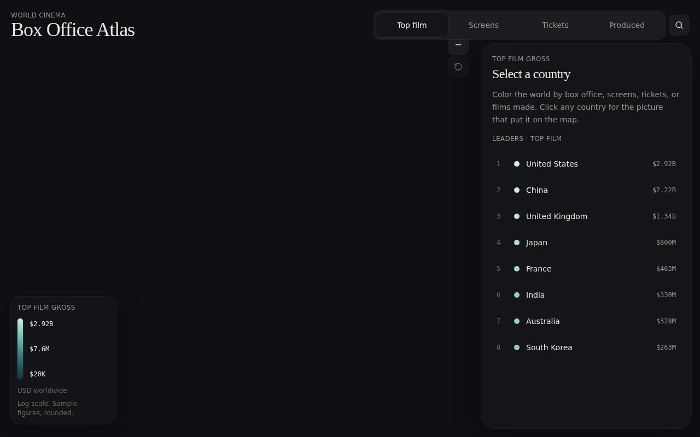

# 🌍 World Film Atlas

An interactive choropleth map of world cinema — explore every country's highest-grossing film, cinema screen counts, annual admissions, and production volumes.



## Features

- **Interactive world map** — click any country to reveal its cinema profile
- **4 choropleth metrics** — Top Film Gross, Cinema Screens, Admissions, Films Produced
- **200+ countries** — each with its highest-grossing film, director, studio, synopsis
- **Country detail panel** — film poster, stats, and leaderboard
- **Keyboard navigation** — `Ctrl+K` / `/` to search, `Esc` to close
- **Responsive** — full-screen map on desktop, bottom sheet on mobile
- **Dark theme** — cinematic dark palette with Fraunces + IBM Plex typography

## Tech Stack

- **React 19** + **TypeScript**
- **TanStack Start** (file-based routing, SSR)
- **Vite 8** + **Tailwind CSS 4**
- **react-simple-maps** + **D3** (geo projections, color scales)
- **Zustand** (state management)
- **Radix UI** (accessible primitives)
- **Nitro** (server, Vercel preset)

## Getting Started

```bash
npm install
npm run dev
```

Open [http://localhost:8080](http://localhost:8080).

## Deployment

Deployed on Vercel:

**🔗 [world-film-atlas.vercel.app](https://world-film-atlas.vercel.app)**

## License

MIT


 
 
 
 
 
